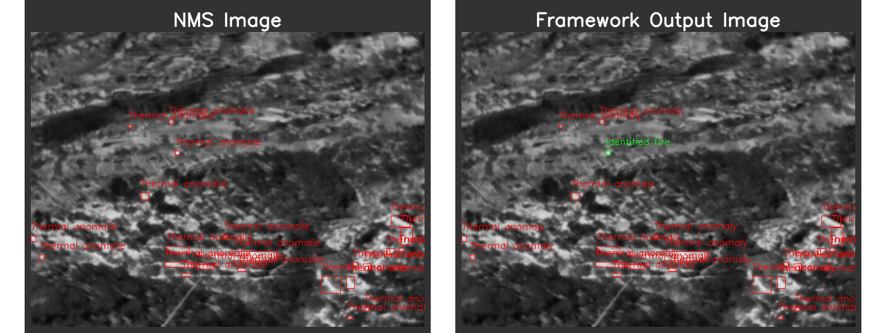

# IFTH

 
Welcome to the official repository for "Integrated Framework for Fire Detection and Identification Using Thermal Imaging" (recently submitted). This repository contains all the necessary resources to replicate the experiments presented in our work.

 
Note that you will need to <a href="https://docs.ultralytics.com/modes/train/" target="_blank">perform training</a> using the pre-trained models from  <a href="https://docs.ultralytics.com/models/" target="_blank">Ultralytics</a> to run this code effectively. On the other hand, we provided a training script for the Faster-RCNN model discussed in the paper.

## 📂 Dataset Access and Usage

 
The Thermal Anomalies (TA) dataset proposed in this work for the training stage uses some image pairs of two open-access datasets for research purposes: the FLIR ADAS, and the TarDAL M3FD. To replicate the results of this project, please download these datasets and merge them with the images and labels we provided. References for downloading and citing the datasets can be found in the paper. All image annotation this research team makes retains their original naming convention to ensure consistency. 

 
On the other hand, our research team completely acquired the Fire’s Latent Activity Monitoring and Evaluation through Thermography (FLAME-T) dataset. 

 
Inside both folders a script called <code>yolo2coco.py</code> can be used to convert the YOLO annotations to COCO format to train the Faster R-CNN implemented with PyTorch.

### Terms and Conditions
* FLIR ADAS Dataset: Refer to the <a href="https://www.flir.com/oem/adas/adas-dataset-agree/" target="_blank">FLIR ADAS Terms of Use</a> for conditions on FLIR ADAS data usage.
* TarDAL M3FD Dataset: Use of the M3FD dataset is subject to the <a href="https://github.com/JinyuanLiu-CV/TarDAL" target="_blank">TarDAL Terms of Use</a>.
* Rest of TA dataset (captured by ourselves): Use of this dataset is subject under <a href="https://creativecommons.org/licenses/by-nc/4.0/" target="_blank">CC BY-NC 4.0 license Terms of Use</a>.
* FLAME-T dataset: Use of this dataset is subject under <a href="https://creativecommons.org/licenses/by-nc/4.0/" target="_blank">CC BY-NC 4.0 license Terms of Use</a>.

## 💻 Materials

 To train the models as thermal anomaly detectors, please download the TA dataset from its Mendeley data repository: <a href="https://data.mendeley.com/drafts/pjh49p8c3r?folder=342e307c-2a66-4601-9bdc-2d7d5dbf502a" target="_blank">TA dataset</a>. We have uploaded all images and labels for the TA dataset images captured by ourselves, while only the labels for the other open-access datasets are included. Please refer to the original download links to obtain the respective images for these datasets. Inside the "ADAS_M3FD" folder, you will find the script <code>apply_modifications.py</code>, which must be used to recreate the synthetic thermal anomalies we generated for the respective datasets. Please ensure that each folder contains the corresponding original datasets before running the script.
 

 The proposed FLAME-T dataset is available in the Mendeley data repository: <a href="https://data.mendeley.com/drafts/x6gty88k4f" target="_blank">FLAME-T</a>. Before running the provided examples, ensure that the dataset folder is included within this repository.

 

 
The Nvidia Jetson Nano study carried out in this work was possible thanks to the docker image available at <a href="https://docs.ultralytics.com/es/guides/nvidia-jetson/#quick-start-with-docker" target="_blank">Ultralytics</a>. The <a href="https://docs.ultralytics.com/modes/export/" target="_blank">model export format</a> was also possible thanks to the official implementation made by Ultralytics.

## 🔧 Dependencies and Installation 
* Python == 3.10.8
* opencv-python-headless == 4.10.0.84
* numpy == 1.26.1
* ultralytics == 8.3.19
* scikit-image == 0.22.0
* scikit-learn == 1.3.2
* tabulate == 0.9.0
* colorama == 0.4.6
* torch == 2.1.1
* torchinfo == 1.8.0
* torchvision == 0.16.1
* onnxruntime == 1.20.1

## 🚀 Code Overview

The methods developed in this work can be found in the code folder. The <code>utils.py</code>, <code>metrics.py</code>, and <code>TA_detector.py</code> files implement state-of-the-art algorithms used in this work (IoU, mAP, F1, NMS algorithm, etc.), as well as the thermal anomalies detectors and the proposed identification algorithm. To run the example, the FLAME-T dataset must be downloaded and inside the "datasets" folder.

The data augmentation process implemented in this work builds upon the methods developed by  <a href="https://github.com/muhammad-faizan-122/yolo-data-augmentation" target="_blank">muhammad-faizan-122</a>, whose repository provides a code example using the Almbumentations library. The <code>main.py</code> and <code>utils.py</code> given in this repository are modifications from his original code.

The <code>test_framework.py</code> file shows an example of thermal anomaly detection and fire identification. The result shows with red color the class corresponding to thermal anomalies, and with green color the identified fire.

     

##  BibTeX
<!-- @InProceedings{aa,
    author    = {aa},
    title     = {aa},
    date      = {2024}
} -->

## 📜 License
This project is released under the AGPL-3.0 license.

## 📧 Contact
If you have any questions, please email antonio.galvan@ulpgc.es.
