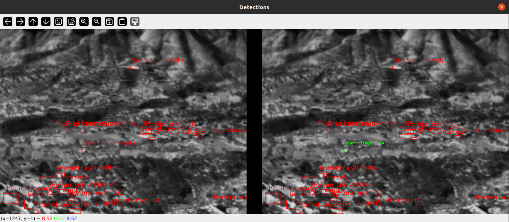

# IFTH
 
 
This is the official repository of "Integrated Framework for Fire Detection and Identification Using Thermal Imaging" (recently submitted). In this repository, you can find all the annotations discussed in the article, in addition to the images that have been proposed by the team.

 
It should be noted that the FLIR and $M{^3}FD$ images are open access and can be downloaded from the links provided in the paper. The annotations made respect the original name of these images.

## 💻 Materials

 
All the code necessary to replicate our work is available in this repository. The datasets are available via Mendeley data at <a href="https://data.mendeley.com/drafts/x6gty88k4f" target="_blank">FLAME-T</a>. For the Nvidia Jetson Nano, we used the docker image available at <a href="https://docs.ultralytics.com/es/guides/nvidia-jetson/#quick-start-with-docker" target="_blank">Ultralytics</a>.

## 🔧 Dependencies and Installation 
* Python == 3.10.8
* opencv-python-headless == 4.10.0.84
* numpy == 1.26.1
* ultralytics == 8.3.19
* scikit-image == 0.22.0
* scikit-learn == 1.3.2
* tabulate == 0.9.0
* colorama == 0.4.6

## 🚀 Code

The functions developed in this work can be found in the code folder. The utils.py, metrics.py, and TA_detector.py files implement basic functions used in this work (IoU, mAP, F1, NMS algorithm, etc.), as well as the thermal anomalies detectors and the proposed identification algorithm. Take into account that the FLAME-T dataset must be downloaded and inside the "datasets" folder to run the example.

The data augmentation process implemented in this work builds upon the methods developed by  <a href="https://github.com/muhammad-faizan-122/yolo-data-augmentation" target="_blank">muhammad-faizan-122</a>, whose repository provides a code example using the Almbumentations library.

The test_framework.py file shows an example of thermal anomaly detection and fire identification. The result shows with a red color the class corresponding to thermal anomalies, and with a green color the identified fire.

     

##  BibTeX
<!-- @InProceedings{aa,
    author    = {aa},
    title     = {aa},
    date      = {2024}
} -->

## 📜 License
This project is released under the GPL-3.0 license.

## 📧 Contact
If you have any questions, please email antonio.galvan@ulpgc.es.
